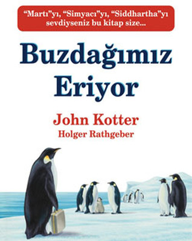

# Değişim Başlıyor

Yakın zamanda kişisel ve organizasyon değişim süreçleri ile ilgili iki kitap okudum. Bu kitapları okuduğum zaman aslında bildiğim ama hoşuma gitmeyebilecek değişim etkileriyle nasıl başa çıkılacağını ve değişim aşamalarını gördüm. Kitapları siz de okuduğunuz zaman değişim süreci içinde olup olmadığınızla ilgili değişik bir farkındalık kazanabilirsiniz.

## Peynirimi Kim Kaptı ?

Kitap hayatta olduğu gibi durmadan değişen şartların olduğu bir labirent içinde peynir arayan 4 sevimli karakterin hikayesi anlatılıyor. Karakterimiz; her sabah kalkıp, spor ayakkabılarını ve eşofmanlarını giyerek labirentte kendilerini mutlu edecekleri peynirleri arıyorlar.

Karakterlerin isimleri değişim karşısında insanların sergiledikleri davranışları sınıflandırmak için kullanılmış. **Koklarca** ve **Koşarca** değişimin kokusunu alıp basit aksiyon alırken, **Kırın** ve **Mırın** insanlar gibi düşünce yeteneğini ve eski tecrübelerini kullanarak daha detaylı bir çalışma yaparak aksiyon alıyorlar.

Peyniri hepsi buluyor ama hikayenin esas kısmı bulma sırasında değil, peynir bittiği zaman başlıyor. Hikayenin devamını okumanız için anlatmıyorum.

Ana fikir; değişim sizin elinizde değilse durumu eşitlemek için mutlaka değişime ayak uydurmaya başlamak gerekiyor olduğu.

## Buzdağımız Eriyor

Bu kitap aslında John Kotter’ın [Leading Change](https://www.amazon.com/Leading-Change-New-Preface-Author/dp/1422186431) kitabının özeti (hap hali olarak düşünebilirsiniz). Antartika’da yaşayan bir bir grup kral penguenin hikayesini anlatıyor.

Bir gün meraklı ve araştırmacı bir penguen yaşadıkları buz dağının eridiğini söylüyor ve bunu kanıtlarıyla gösteriyor. Hikaye bu şekilde başlıyor ve sonunda yerleşik yaşayan penguenler göçebe penguenler haline dönüşüyorlar.

Kitabın içinde saklı olan adımların her biri organizasyon değişimlerinde karşımıza çıkan veya çıkacak olan kaçınılmaz adımlarla, çözüm aksiyonlarını gösteriyor diyerek meraklandırıp okumayı size bırakıyorum.

Özet olarak değişim kaçınılmaz ve bir gün mutlaka olacak. Önemli olan değişim olduğunda nasıl davrandığımız. İki kitabı okuduktan sonra değişim ile başa çıkmak için aşağıdaki adımları göz önünde bulundurmamız gerektiğini düşünüyorum.

- Değişimin olduğunu kabul edin.
- Değişim olduğunda karşı koymak sadece zaman kaybı yaratacaktır. Dimyat’a pirince giderken evdeki bulgurdan olmamak lazım.
- Değişim ile ilgili etrafınızdakileri bilgilendirin.
- Değişimi görünür hale getirin. Herkes, değişimin olduğunu, neden değişime ihtiyaç olduğunu ve sonucunda neler olabileceğini görebiliyor olsun.
- Değişime inanmayanlar için aciliyet duygusunu ön planda olacak şekilde ilerleyin.
- Değişime öncülük edecek bir takım kurun ya da bir motivasyon kaynağı bulun. Yoksa değişim için harekete geçilmek çok uzun sürebilir.
- Değişime nasıl ayak uyduracağınızı ya da değişimle nasıl başa çıkacağınızı planlayın. Etkilenen kişiler varsa onları da planlamaya dahil etmeyi unutmayın.
- Devrimsel ya da deneysel olmaktan korkmamak lazım. En korkulan fikri bile denemeye açık olun.
- Değişimden etkilenen başkaları da varsa, tek başınıza yapmayın etkilenen herkesi değişim sürecin dahil edin. Kimseyi geride bırakmayın.
- Değişim yolundaki ufak kazanımları mutlaka ödüllendirin. Ödüllendirildiği zaman değişimden etkilenenler ve değişime öncülük edenler daha da motive olacaktır. Değişime karşı çıkanlar da değişime inanmaya başlayabilirler.
- Değişime katılmak istemeyen, değişime inanmayan ya da değişimde harekete geçmekte zorlanan kişileri güçlendirin ve onları motive edin.
- Yapılanları adım adım değerlendirin. Hatalı gördüğünüz kısımları düzeltin ve tekrar ilerleyin.
- Değişim rahatsız edecek. Bu yüzden değişimin kişisel alışkanlıkları veya şirket kültürünü değiştirmesini sağlayın, yoksa değişim kalıcı olmayacak yapılanlar boşa gidecektir.
- Kitapların, farkındalık yaratması için önemli olduğunu düşünüyorum. Kitapları okuduğunuzda yazının altına yorumlarınızı bekliyorum.
